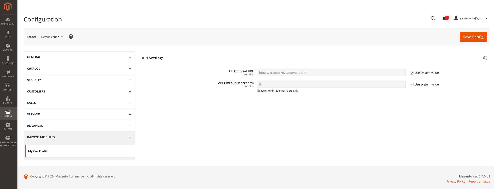
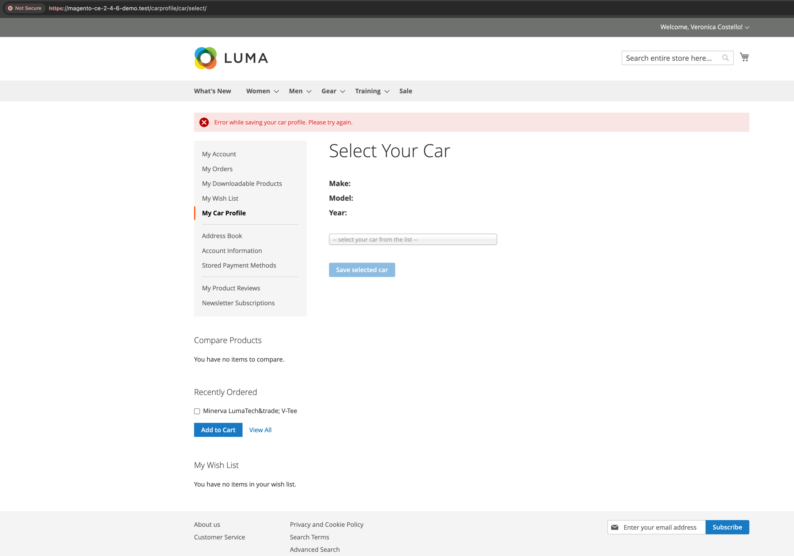
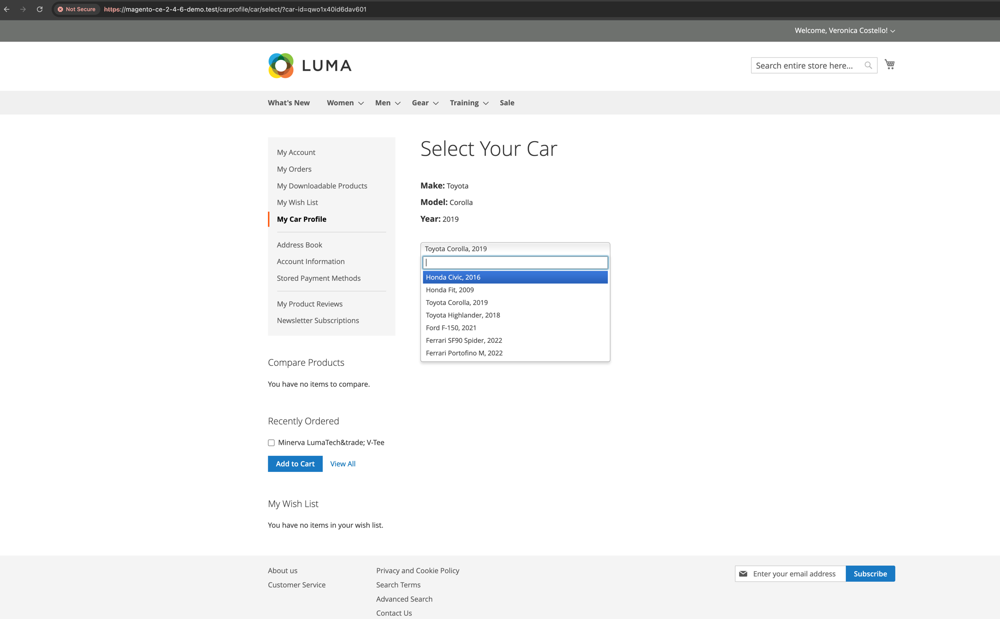
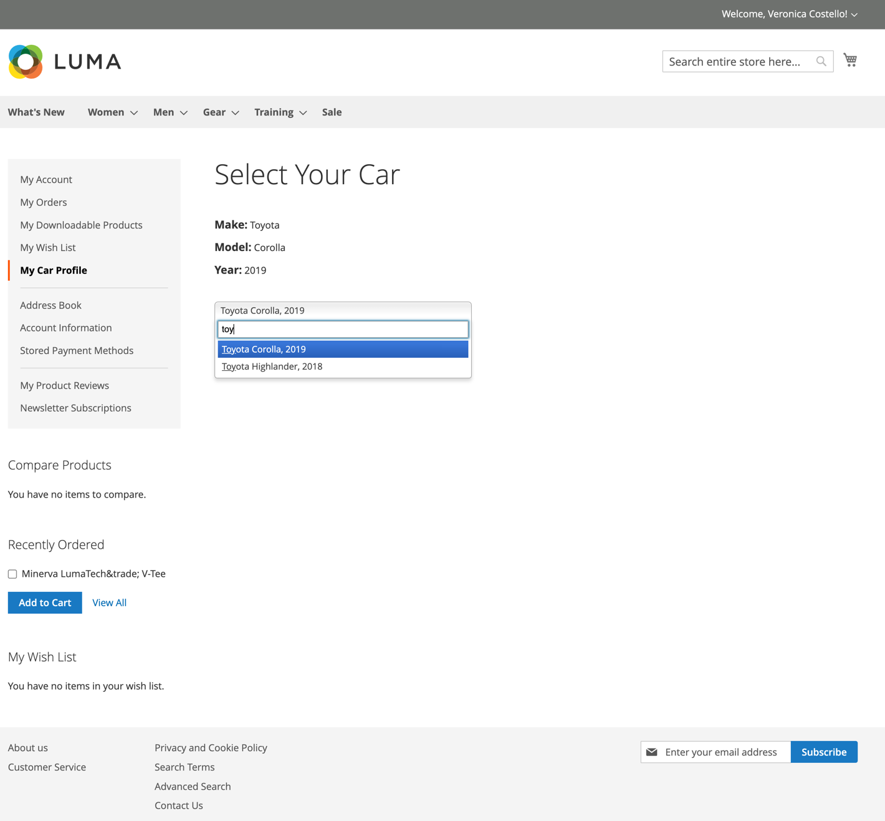

# Razoyo-CarProfile

## Module Screencast
Please refer to the module's screencast (short video) for a high-level overview of how this module works:   
[module-screencast.mov](screencast/module-screencast.mov)

## How the Module Works
- A custom customer attribute called "car_id" was added via a Data Patch script. This attribute holds the selected car ID for each customer, obtained from the Razoyo-CarProfile API. Additional car information is fetched in real-time from the API when the selected car is displayed.
- The module's settings can be managed via the Magento admin configuration page.
- Comprehensive error handling has been implemented, logging error details into log files and displaying appropriate messages to the customer.
  A car search functionality has been added to the frontend. This feature is designed for enterprise integrations and can handle API responses with hundreds of car models and makes. It enables users to find cars by searching for their model, make, or year.
- The module includes three controllers. Please refer to the "Module Flow" section for more details: 
  - Select Car (GET) - Renders the car selection page.
  - Display Car (GET) - Renders the page for the selected car.
  - Save Car (POST) - Saves the selected car to the customer's profile.

## Module Flow
- The "My Car Profile" link defaults to the Display Car controller. If a customer has a saved car ID in their profile, the specific car information will be fetched using the car API and displayed on the storefront.
- If a customer does not have a saved car ID, they will be redirected to the Select Car controller when the "My Car Profile" link is clicked, as there is no car to display.
- Once a customer selects a car, the selected car ID will be saved to the customer's profile using the Save Car controller.

## Module settings
Module settings can be managed via the Magento admin configuration page, allowing you to edit the API endpoint URL and API timeout settings without modifying the code:

## Error Handling
Comprehensive error handling logic has been implemented. This logs error details into log files and displays appropriate messages to the customer in case of issues such as API call errors, non-200 API responses, unexpected API data structures, or missing expected data. When an error occurs, the customer will be redirected to the appropriate controller based on the initial request point, for example:

## Car Search Functionality
A car search functionality has been added to the frontend. This feature is designed for enterprise integrations and can handle API responses with hundreds of car models and makes. It allows users to easily find cars by searching for their model, make, or year:

Start using the search box:

